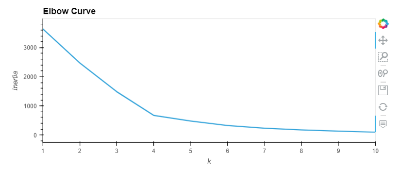
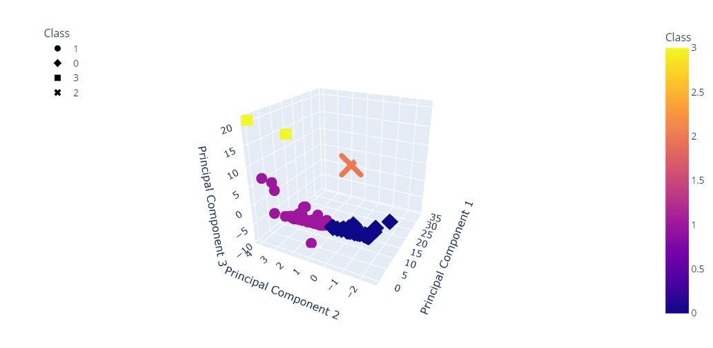
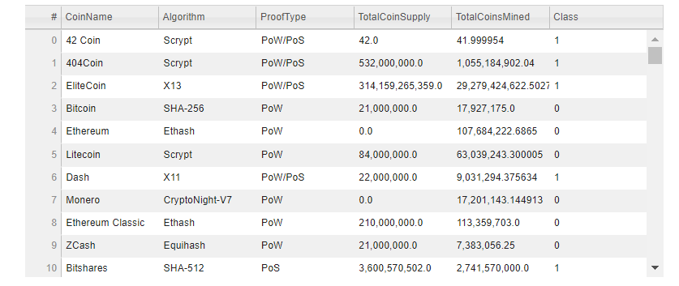

# Cryptocurrencies
## Purpose and Overview of Analysis
The purpose of this analysis is to utilize an unsupervised machine learning algorithm to analyze trends between different cryptocurrencies. A data clustering algorithm called KMeans from the scikit-learn library was implemented for this analysis. A principal component analysis (PCA) was done using scikit-learn to identify key features that were to be accounted for in the KMeans model. This analysis is useful for deriving insight from different cryptocurrencies in a variety of use cases. 

More detailed review of steps taken in this analysis:
* **Data preprocessing** using the **pandas** library to prepare the data for a machine learning analysis.
* **Data standardization** was done using **scikit-learn's StandardScaler** to normalize scale of values of different features.
* **Dimension reduction** using **Principal Component Analysis (PCA)** was done using **scikit-learn** to include the three most relevant features of the data in analysis.
* An **elbow curve** was made to find the proper number of data clusters to make for the KMeans model.
* **scikit-learn's KMeans** algorithm was implemented to cluster data into four distinct groups. This means that according to the three most relevant features of the dataset, there were four distinct groups that could be formed with similar values for these features. 
* These data clusters were then **visualized** using both two-dimensional and three-dimensional plots that will be shown in the figures below. **hvplot** and **plotly's express** were used for these visualizations.

## Figures from analysis

**Figure 1:** Elbow curve to find that K=4 was best for KMeans model.  
  

**Figure 2:** 3D scatter plot showing data clusters found using KMeans algorithm according to the top three features which were found using PCA.  

  

**Figure 3:** Sample from hvplot table created showing some of the crytocurrencies used, some relevant information, and the class (cluster number) that they were assigned.   
